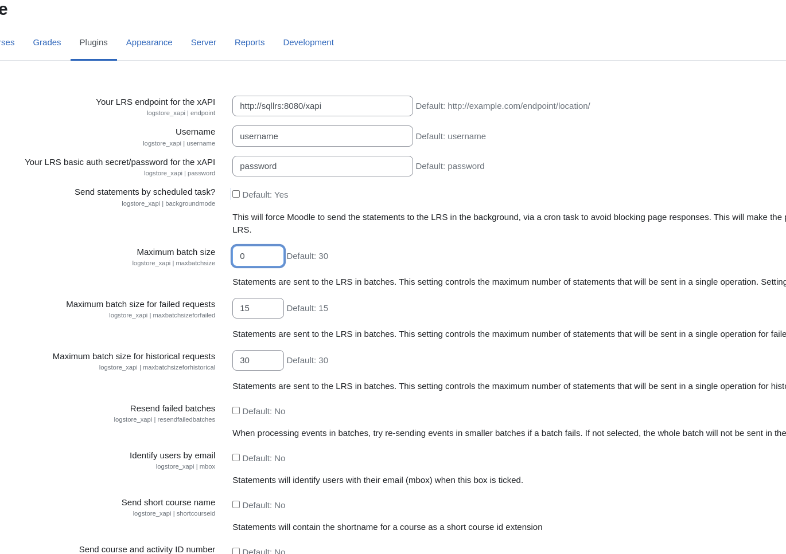

# [Moodle Logstore xAPI](https://moodle.org/plugins/view/logstore_xapi)
> Emits [xAPI](https://github.com/adlnet/xAPI-Spec/blob/master/xAPI.md) statements using the [Moodle](https://moodle.org/) Logstore.

- Install the plugin using [our zip installation guide](/docs/install-with-zip.md).
- Process events before the plugin was installed using [our historical events guide](/docs/historical-events.md).
- Ask questions via the [Github issue tracker](https://github.com/xAPI-vle/moodle-logstore_xapi/issues).
- Report bugs and suggest features with the [Github issue tracker](https://github.com/xAPI-vle/moodle-logstore_xapi/issues).
- View the supported events in [our `get_event_function_map` function](/src/transformer/get_event_function_map.php).
- Change existing statements for the supported events using [our change statements guide](/docs/change-statements.md).
- Create statements using [our new statements guide](/docs/new-statements.md).


## Yet Instructions
These instructions are a guide to make a working moodle logstore dev environment. It is slightly involved, but I am trying to document everything here

### Cloning Repos
So you need three repos. Unfortunately unless we figure a way around it you need to embed one of the repos into another.

#### Clone Moodle Source
`git clone https://github.com/moodle/moodle.git [Moodle Src Dir]`

#### Clone Logstore Source
Navigate to `[Moodle Src Dir]/admin/tool/log/store`. What we are going to do is clone THIS repo into new `xapi` dir within that location. 

```
cd [Moodle Src Dir]/admin/tool/log/store
git clone git@github.com:yetanalytics/moodle-logstore.git xapi
```

#### Clone Docker Support
Now we are going to clone another repo, specifically a Yet version of the `moodlehq/moodle-docker` docker support repo.

`git clone git@github.com:yetanalytics/moodle-docker.git [Docker Support Dir]`

### Starting Up
Now that we have all the stuff, we can start setting things up. 

1: First you need to run some commands to init the environment

```bash
# Set up path to Moodle code
export MOODLE_DOCKER_WWWROOT=[Moodle Src Dir]
# Choose a db server (Currently supported: pgsql, mariadb, mysql, mssql, oracle)
export MOODLE_DOCKER_DB=pgsql

# Ensure customized config.php for the Docker containers is in place
cp config.docker-template.php $MOODLE_DOCKER_WWWROOT/config.php

# Start up containers
bin/moodle-docker-compose up -d

# Wait for DB to come up (important for oracle/mssql)
bin/moodle-docker-wait-for-db
```

This starts all the associated services including the LRS. When you eventually want to shut these down, it's:

`bin/moodle-docker-compose down`

So far I haven't really figured out persisting this stuff, would be a good next step. As it stands you need to do everything below this point again every time you do a container restart.

2: Then I recommend to skip web-based "installation" by running a command to basically preinstall moodle in a testing configuration.

`bin/moodle-docker-compose exec webserver php admin/cli/install_database.php --agree-license --fullname="Docker moodle" --shortname="docker_moodle" --summary="Docker moodle site" --adminpass="test" --adminemail="admin@example.com"`

This will setup a single admin account with the following credentials:

Username: `admin`

Password: `test`

You should not be able to login at `localhost:8000` with the above creds.

### Configure Logstore

Now we need to do a few things in moodle to get the xAPI Logstore running. 

#### Turn on Logstore
- Log In as admin
- Navigate to `Site Administration` at the top
- Go to `Plugins`
- Go down to `Logging` section
- Click `Manage Log Stores`
- On this page, click the eye icon to Enable `Logstore xAPI`
- After it's enabled, click `Settings` on that row
- Configure the following settings and click Save:


### Using Logstore

You should now have a working plugin. Any events that are instrumented should be sent to the SQL LRS install. You can get there via localhost:8080. 

asiest test is just create and view a course as the admin user. That should send statements.
